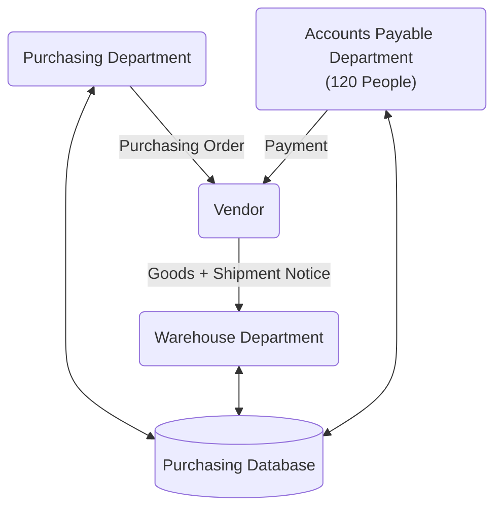

# IE203 - Bài Tập Trên Lớp - Buổi 01

[TOC]

## Yêu Cầu

1. Who are the actors in this process?
2. Which actors can be considered as customers in this process?
3. What value does the process deliver to its customers?
4. What are the possible outcomes of this process?

## Bài Làm

Tóm tắt: Sơ đồ trên miêu tả một quy trình mua sắm hàng hóa từ gửi yêu cầu tới thanh toán. Rất có thể là một mô hình mua hàng B2B (Business to Business).

1. Who are the actors in this process?
2. Which actors can be considered as customers in this process?
3. What value does the process deliver to its customers?
4. What are the possible outcomes of this process?

### Who are the actors in this process?

> Các tác nhân tham gia trong quy trình này?

Chúng ta có các tác nhân/actor sau đây:

- Purchasing Department (PD): Bộ phận mua hàng. Là bộ phận phát sinh yêu cầu và bắt đầu quy trình.
- Warehouse Department (WD): Bộ phận kho. Bộ phận tiếp nhận và lưu giữ hàng hóa.
- Accounts Payable Department (APD): Bộ phận kế toán. Bộ phận thực hiện nghiệp vụ thanh toán tài chính.
- Purchasing Database (PDB): Cơ sở dữ liệu mua hàng. Lưu trữ các thông tin liên quan đến quá trình mua hàng.
- Vendor (VD): Nhà cung cấp. Là một tác nhân bên ngoài công ty so với 3 bộ phận trên, chịu trách nhiệm cung cấp hàng hóa.

### Which actors can be considered as customers in this process?

> Tác nhân nào được xem là Khách hàng trong quy trình này?

Purchasing Department (PD) được xem là Khách hàng trong quy trình này.

- PD là nơi đánh giá về nhu cầu hàng hóa, và gửi yêu cầu mua hàng từ đó phát sinh ra các bước khác như: nhận hàng của kho (WD), và thanh toán của kế toán (APD).

### What value does the process deliver to its customers?

> Quy trình mang lại giá trị gì cho khách hàng?

PD là khách hàng trong quy trình này, và đây là một quy trình Procure-to-pay (Mua - Bán):

- Quy trình này cung cấp khả năng sẵn hàng cho bộ phận PD, từ đó giúp PD hoàn thành các nghiệp vụ liên quan khác, ví dụ như cung cấp hàng hóa cho các bộ phận nội bộ trong công ty, hoặc các đối tác/khách hàng của công ty.

### What are the possible outcomes of this process?

> Những kết quả nào có thể xảy ra khi kết thúc quy trình?

Một số kết quả có thể xảy ra của quy trình này:

- Quy trình hoàn thành:
    - Hàng hóa sẵn hàng và được vận chuyển tới kho; bộ phận kho lưu giữ hàng hóa; bộ phận kế toàn hoàn thành thanh toán đúng hạn.
    - Bên mua (PD), bên bán (VD) và các bên liên quan đều hài lòng.
- Quy trình không hoàn thành:
    - Hàng hoá không có sẵn: cần thêm thời gian để sản xuất, bổ sung.
    - Hàng có sẵn nhưng không đáp ứng yêu cầu về chủng loại, số lượng: cần chờ bổ sung hoặc thay đổi yêu cầu.
    - Hàng hóa có sẵn và đáp ứng mọi yêu cầu nhưng không phù hợp về giá cả, chi phí: cần thay đổi về chiến lược và quản lý chi phí.
    - Có vấn đề về vận chuyển (logistic): thiếu phương tiện, hoặc phát sinh chi phí về thuế quan, cảng, kho bãi.
    - Có vấn đề về kho: kho không đủ không gian hoặc năng lực để tiếp nhận (quá nhỏ, hết chỗ; không có phòng lạnh chuyên dụng, vv..).
    - Không thanh toán đúng hạn: bộ phận APD không thanh toán đúng hạn theo yêu cầu của nhà cung cấp.
        - Có thể dẫn đến tình trạng từ chối giao hàng, vì quy trình trên không chỉ rõ thứ tự là thanh toán rồi giao hàng, hay giao hàng rồi thanh toán.
        - Có thể dẫn đến tình trạng không chấp nhận đơn hàng lần sau hoặc gây khó khăn hơn (yêu cầu chứng minh tài chính, cam kết thanh toán đúng hạn), có nghĩa thêm thủ tục và thời gian.
