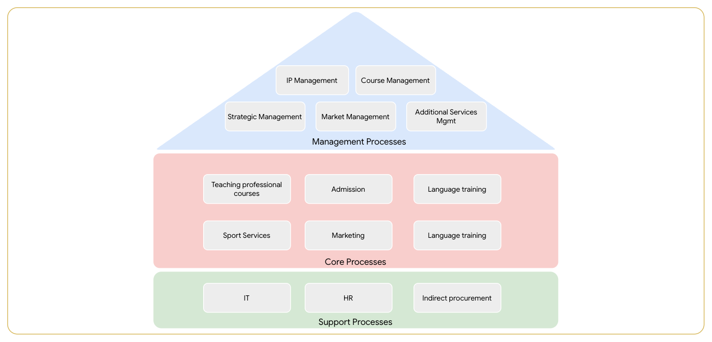

# IE203 - Buổi 02 - Bài Tập Tại Lớp 01

## Yêu cầu

> - Các em phân loại các bộ phân vào các quy trình tương ứng.  
> - Tên file là MSSV các thành viên trong nhóm.

## Bài Làm

### Danh Sách Các Bộ Phận

| **STT** | **Tên**                     | **STT** | **Tên**                           |
| --: | ----------------------- | --: | ----------------------------- |
|   1 | Additional services mgt |   8 | Language training             |
|   2 | Admission               |   9 | Market management             |
|   3 | Course Management       |  10 | Marketing                     |
|   4 | HR                      |  11 | Sport services                |
|   5 | Indirect procurement    |  12 | Strategic Management          |
|   6 | IP Management           |  13 | Teaching award courses        |
|   7 | IT                      |  14 | Teaching professional courses |

### Phân Loại Theo Quy Trình

| **Management Processes** | **Core Processes**            | **Support Processes** |
| ------------------------ | ----------------------------- | --------------------- |
| Additional services mgt  | Admission                     | HR                    |
| Course Management        | Language training             | Indirect procurement  |
| IP Management            | Marketing                     | IT                    |
| Market management        | Sport services                |                       |
| Strategic Management     | Teaching award courses        |                       |
|                          | Teaching professional courses |                       |

### Trực Quan Hóa Quy Trình và Bộ Phận

