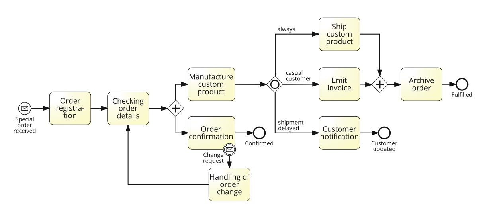
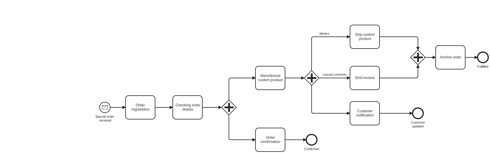

# IE203 - Buổi 03 - Bài Tập Tại Lớp 01

## Yêu Cầu

A process model for fulfilling special orders. Consider the model in Figure with reference to the following process description. Is this model valid and complete? If not, what statements are invalid and what is missing?

**Description**:

- When a special **order is received**, it is **first registered** and then its **details are checked**.
- Next, the **order is confirmed** and **meantime** the **custom product is manufactured**. Once the product has been made, the shipment can be planned.
- Afterwards, the customer type and shipment status are checked. In fact, if a customer is casual an ad hoc invoice must be emitted, which is not required for ordinary customers. In the latter case, the customer account is simply charged with the costs related to the order fulfillment. Moreover, if the shipment has been delayed, the customer must be updated on the expected delay.
- Concomitantly to these activities, the custom product is shipped. After the latter activity and after the invoice has been emitted, the process completes with the archival of the order. Any time during the confirmation of the order and the manufacturing of the respective product, an order change request may be received, in which case any activity must be interrupted to handle the change request.
- This includes the registration of the order variation and a notification to the customer, after which the process resumes from the order checking.  

Is the process model in Figure of good pragmatic quality? If not, how can it be improved?

## Bài Làm

