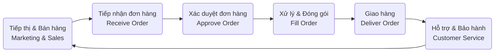
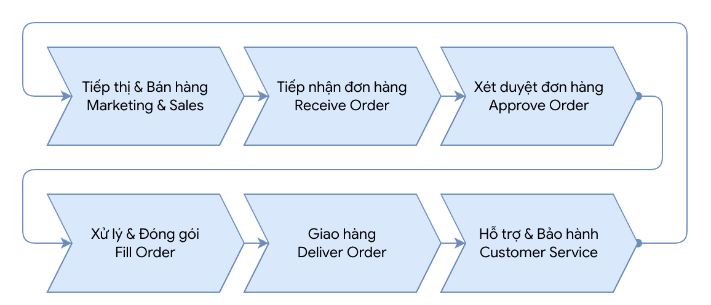

# IE203 - Buổi 02 - Bài Tập Về Nhà 02

## Yêu Cầu

Consider a company that sells electronic equipment (TVs. Laptops and accessories, home appliances, etc.) online.

Enumerate at least 10 processes or process groups in this company, distributed more or less evenly across management, core and support processes.

Specify a core value chain in this company.

## Bài Làm

### Danh Sách Các Bộ Phận

Tổng quan các bộ phận của một Công Ty Thương Mại Điện Tử, kinh doanh hàng điện tử, điện lạnh bao gồm:

| **STT** | **Tên**                                               | **STT** | **Tên**                                           |
| ------: | ----------------------------------------------------- | ------: | ------------------------------------------------- |
|       1 | Strategic Management: Quản lý chiến lược kinh doanh   |       8 | Digital Marketing: Tiếp thị & Quảng cáo           |
|       2 | Risk Management: Quản trị rủi ro                      |       9 | Order Processing: Xử lý đơn hàng                  |
|       3 | Performance Management: Đánh giá & Quản trị hiệu suất |      10 | Fulfillment & Delivery: Đóng gói & Vận chuyển     |
|       4 | Vendor Management: Quản lý đối tác & Nhà cung cấp     |      11 | Customer Service: Chăm sóc khách hàng & Bảo hành  |
|       5 | Human Resources: Quản trị nhân sự                     |      12 | Finance & Accounting: Quản lý tài chính & Kế toán |
|       6 | Direct Procurement: Tìm kiếm nguồn hàng & Mua sắm     |      13 | IT Operations: Vận hành & Bảo trì hệ thống IT     |
|       7 | Inventory & Warehouse Management: Quản lý kho bãi     |      14 | Indirect Procurement: Mua sắm gián tiếp           |

### Processes or Processes Groups

Có thể sắp xếp, phân bổ thành các nhóm quy trình chính yếu:

| **Management Processes** | **Core Processes**     | **Support Processes** |
| ------------------------ | ---------------------- | --------------------- |
| Strategic Management     | Direct Procuremen      | Human Resources       |
| Risk Management          | Inventory & Warehouse  | Finance & Accounting  |
| Vendor Management        | Digital Marketing      | IT Operations         |
|                          | Order Processing       | Indirect Procurement  |
|                          | Fulfillment & Delivery |                       |
|                          | Customer Service       |                       |

### Core Value Chain

Đối với một doanh nghiệp thương mại điện tử bán đồ điện tử, chuỗi giá trị nằm trong phần cốt lõi của Core Processes là hành trình từ lúc tiếp cận khách hàng cho đến khi hoàn tất giao dịch và hậu mãi, đây là một quy trình liên kết trực tiếp với khách hàng bên ngoài để tạo ra giá trị, như tóm tắt dưới đây.

#### Diễn giải

Chuỗi quy trình này thể hiện rõ dòng chảy tạo ra giá trị trực tiếp cho khách hàng bên ngoài (External Customers – phân biệt với Khách hàng bên trong: nhân viên cũng nhận các giá trị từ các bộ phận liên quan, ví dụ nhân viên IT được xét duyệt mua thiết bị từ phòng ban Kế toán), bao gồm các bước tiếp nối nhau:

- **Tiếp thị & Bán hàng (Marketing & Sales):** Khởi đầu bằng việc tiếp cận khách hàng bên ngoài thông qua website/app, thu hút họ tìm hiểu và lựa chọn các thiết bị điện tử (TV, Laptop...).
- **Tiếp nhận đơn hàng (Receive Order):** Khách hàng tạo giỏ hàng và đặt lệnh mua thành công trên hệ thống.
- **Xác duyệt đơn hàng (Approve Order):** Hệ thống ghi nhận thanh toán, xác minh thông tin khách hàng và kiểm tra tính hợp lệ của đơn hàng.
- **Xử lý & Đóng gói (Fill Order):** Lấy thiết bị điện tử từ kho, kiểm tra chất lượng và số lượng và đóng gói an toàn để chuẩn bị vận chuyển.
- **Giao hàng (Deliver Order):** Vận chuyển đơn hàng thành công và trao tận tay khách hàng, hoàn tất việc cung cấp giá trị vật chất.
- **Hỗ trợ & Bảo hành (Customer Service):** Duy trì giá trị thông qua việc hỗ trợ kỹ thuật, đổi trả hoặc bảo hành thiết bị điện tử sau mua, đảm bảo sự hài lòng của khách hàng.

Khi quy trình hoàn thành, đem đến giá trị tích cực cho tất cả các bên, cụ thể là khách hàng, từ đó tạo niềm tin và tạo cơ hội để khách tiếp tục mua hàng từ các chương trình Tiếp thị & Bán hàng, tạo thành một vòng tròn khép kín, liên tục.

