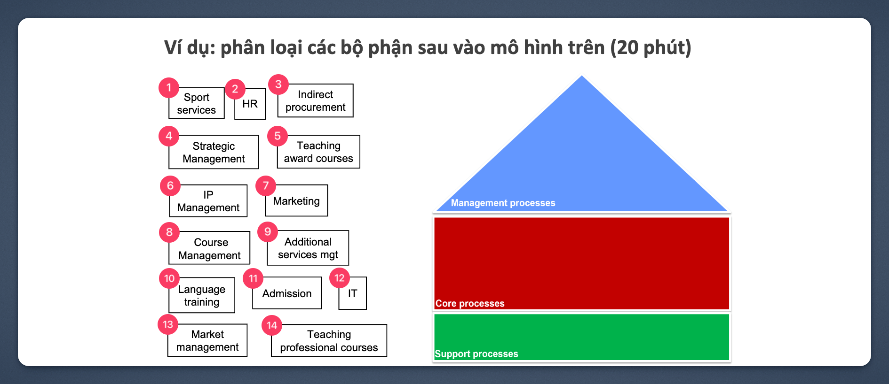

# IE203 - Buổi 02 - Bài Tập Tại Lớp 01

## Yêu cầu

> - Các em phân loại các bộ phân vào các quy trình tương ứng.  
> - Tên file là MSSV các thành viên trong nhóm.

## Bài Làm

### Các Bộ Phận

- Additional services mgt
- Admission
- Course Management
- HR
- Indirect procurement
- IP Management
- IT
- Language training
- Market management
- Marketing
- Sport services
- Strategic Management
- Teaching award courses
- Teaching professional courses

### Phân Loại

#### Management Processes

- Strategic Management
- Course Management
- IP Management
- Additional services mgt
- Market management

#### Core Processes

- Admission
- Marketing
- Teaching award courses
- Language training
- Teaching professional courses
- Sport services

#### Support Processes

