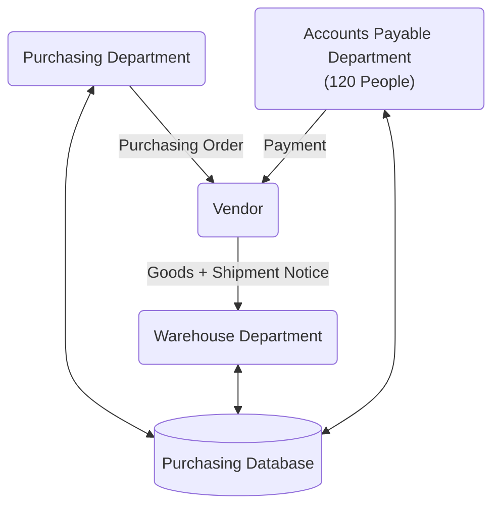

# Bài Tập Trên Lớp - Buổi 01

## Yêu Cầu

1. Who are the actors in this process?
2. Which actors can be considered as customers in this process?
3. What value does the process deliver to its customers?
4. What are the possible outcomes of this process?

## Bài Làm

Tóm tắt: Sơ đồ trên miêu tả một quy trình mua sắm hàng hóa từ gửi yêu cầu tới thanh toán.

1. Who are the actors in this process?
2. Which actors can be considered as customers in this process?
3. What value does the process deliver to its customers?
4. What are the possible outcomes of this process?

### The actors

Chúng ta có các tác nhân/actor sau đây:

- Purchasing Department (PD): Bộ phận mua hàng.
- Warehouse Department (WD): Bộ phận kho.
- Accounts Payable Department (APD): Bộ phận kế toán.
- Purchasing Database (PDB): Cơ sở dữ liệu mua hàng.
- Vendor (VD): Nhà cung cấp.
