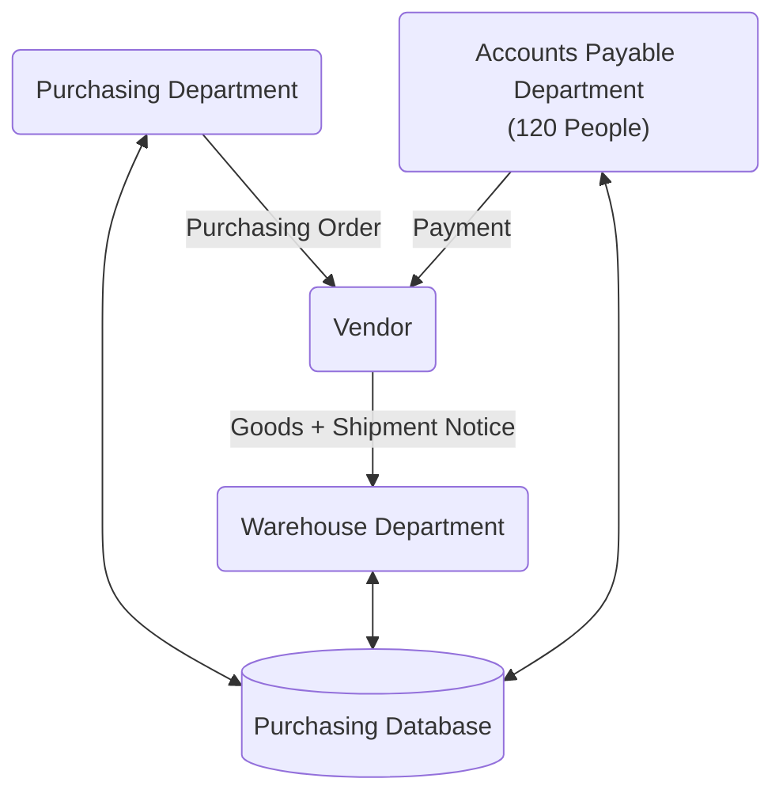

# Bài Tập Trên Lớp - Buổi 01

## Yêu Cầu

1. Who are the actors in this process?
2. Which actors can be considered as customers in this process?
3. What value does the process deliver to its customers?
4. What are the possible outcomes of this process?

## Bài Làm

Tóm tắt: Sơ đồ trên miêu tả một quy trình mua sắm hàng hóa từ gửi yêu cầu tới thanh toán. Rất có thể là một mô hình mua hàng B2B (Business to Business).

1. Who are the actors in this process?
2. Which actors can be considered as customers in this process?
3. What value does the process deliver to its customers?
4. What are the possible outcomes of this process?

### The actors

Chúng ta có các tác nhân/actor sau đây:

- Purchasing Department (PD): Bộ phận mua hàng. Là bộ phận phát sinh yêu cầu và bắt đầu quy trình.
- Warehouse Department (WD): Bộ phận kho. Bộ phận tiếp nhận và lưu giữ hàng hóa.
- Accounts Payable Department (APD): Bộ phận kế toán. Bộ phận thực hiện nghiệp vụ thanh toán tài chính.
- Purchasing Database (PDB): Cơ sở dữ liệu mua hàng. Lưu trữ các thông tin liên quan đến quá trình mua hàng.
- Vendor (VD): Nhà cung cấp. Là một tác nhân bên ngoài công ty so với 3 bộ phận trên, chịu trách nhiệm cung cấp hàng hóa.
