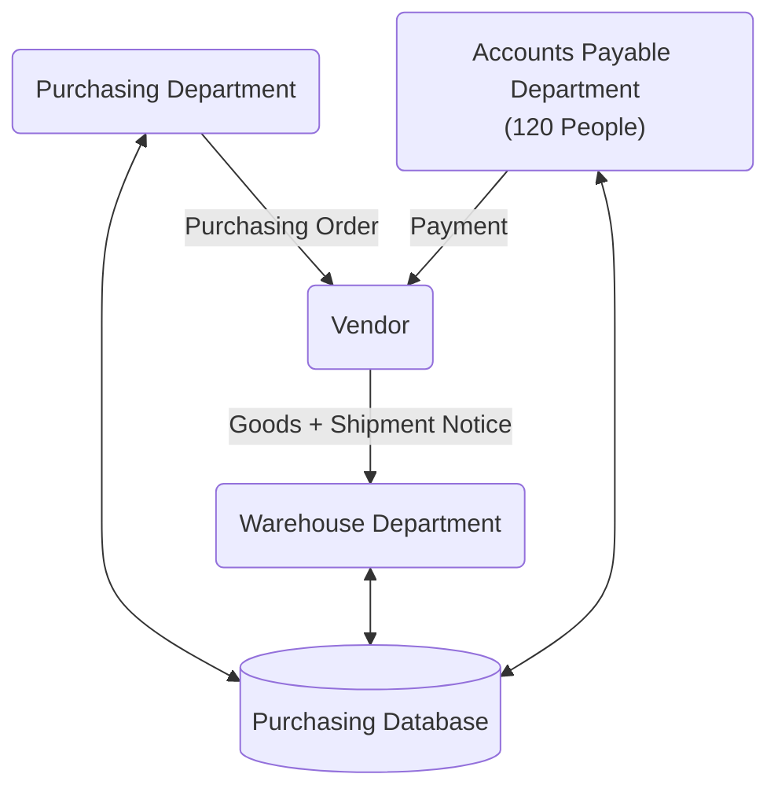
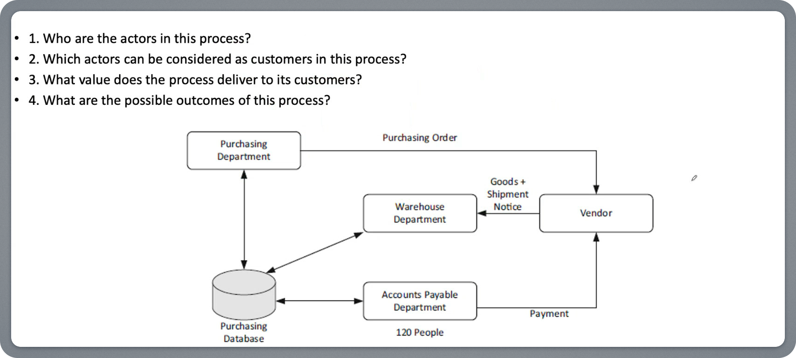

# Bài Tập Trên Lớp - Buổi 01

1. Who are the actors in this process?
2. Which actors can be considered as customers in this process?
3. What value does the process deliver to its customers?
4. What are the possible outcomes of this process?

